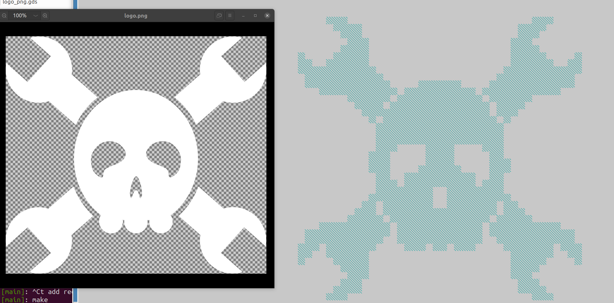
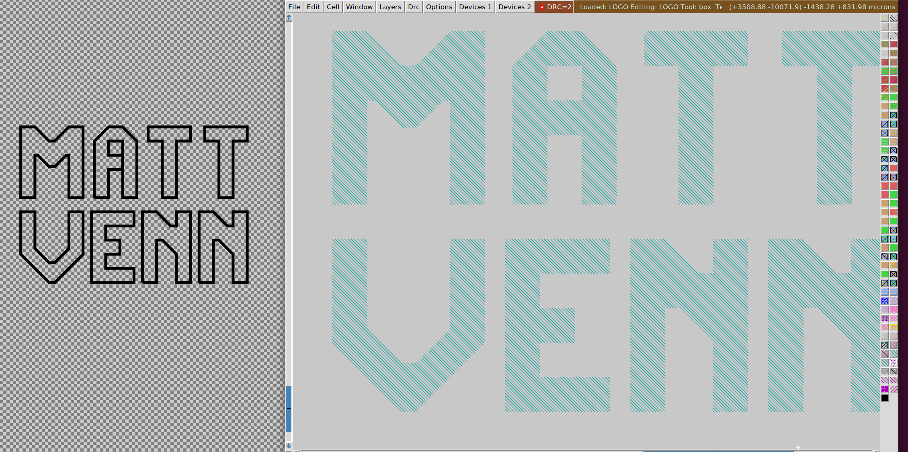

# create logos for ASICs with pngs or svgs

turns SVGs or PNGs into GDS2 and LEF files for use on top metal of ASICs for artwork.

## png

* find/make a suitable png. You will have to work on it to make the final gds be DRC clean.
* choose scaling factor (set in program)

## svg

* set inkscape to units px
* make a 1 px grid
* only use 90 or 45 degree angles
